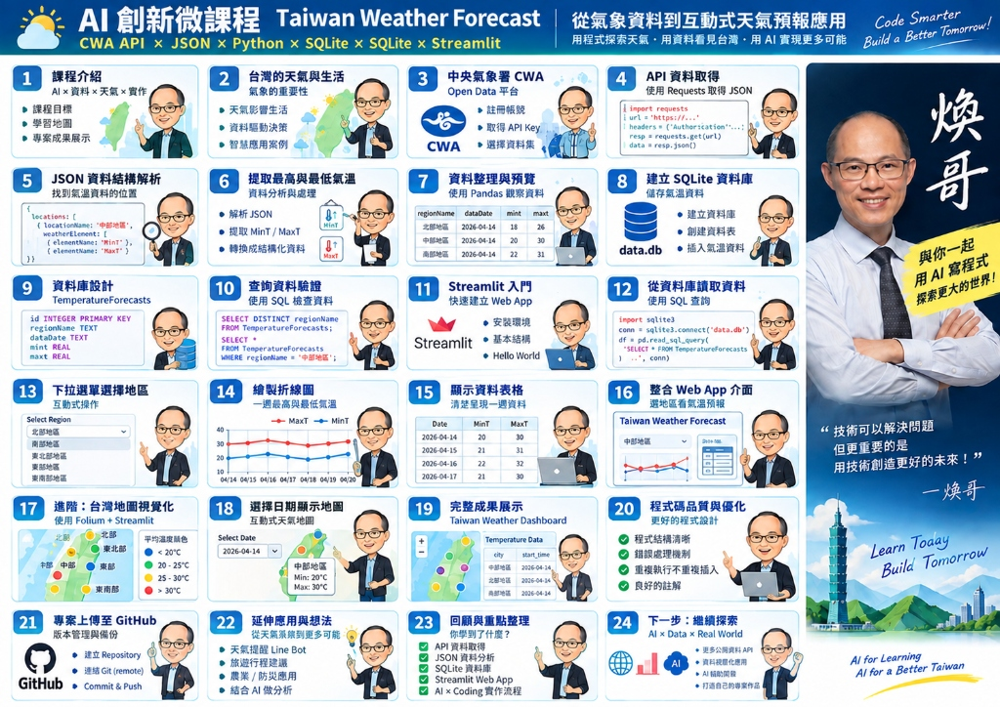

# Taiwan Weather GIS Dashboard
## AIoT L3 — CWA HW1

> **CWA Open Data → Database → Taiwan GIS → GitHub → Vercel**

Live demo website: https://cwa2026.vercel.app/


本作業以中央氣象署（CWA）真實 Open Data 為資料來源，從 API 資料取得開始，經過 ETL 與 SQLite 儲存，再建立本機 Taiwan GIS Web，最後推送 GitHub 並由 Vercel 自動部署。

## 五大 Gate — 進度追蹤

| Gate | 主題 | 狀態 | 備註 |
|---|---|---|---|
| 1 | CWA API | ✅ **PASS** | F-D0047-091, 22縣市, 7天, T/MaxT/MinT/Wx/PoP 全驗證 |
| 2 | Database | ✅ **PASS** | 成功載入 SQLite (data.db)，308筆預報資料 |
| 3 | Taiwan GIS Web | ✅ **PASS** | Flask + Custom Leaflet Glassmorphism UI (server.py) |
| 4 | GitHub | ✅ **PASS** | 源始碼與配置全數推送至 GitHub `main` |
| 5 | Vercel | ✅ **PASS** | 設定 `vercel.json` 與 `api/index.py` 無伺服器連接配置 |

## 核心流程

```text
CWA Government Open Data
        ↓
     REST API
        ↓
       JSON
        ↓
 Parse / Clean / Transform
        ↓
      SQLite
        ↓
   Backend API
        ↓
Taiwan GIS Web
Leaflet + OpenStreetMap + GeoJSON
        ↓
      GitHub
        ↓
      Vercel
        ↓
   Public Website
```

## Gate 1 — CWA API ✅ PASS

**驗證日期：** 2026-09-23  
**Dataset：** `F-D0047-091`（全臺縣市7天天氣預報）  
> 注意：workflow 指定 F-D0047-093，該 ID CWA 尚未上線（404）。F-D0047-091 為已發布的等價 dataset，具備相同 Locations schema 與完整欄位。

**實際 JSON Schema：**
```text
records.Locations[0].Location[]
  └── LocationName
  └── WeatherElement[]
        ├── 平均溫度   (T)   — 14 periods × 12hr = 7 days
        ├── 最高溫度   (MaxT)
        ├── 最低溫度   (MinT)
        ├── 天氣現象   (Wx)
        └── 12小時降雨機率 (PoP)
```

**Gate 1 PASS Checklist：**
```text
[PASS] Dataset = F-D0047-091
[PASS] CWA authentication success
[PASS] HTTP 200 OK, success = true
[PASS] Real JSON received
[PASS] Actual JSON schema inspected
[PASS] 7-day forecast confirmed (14 x 12hr periods)
[PASS] T / MaxT / MinT / Wx / PoP all confirmed
[PASS] 22/22 Taiwan counties coverage confirmed
[PASS] No mock/fake data
[PASS] No API Key exposed
```

**Output：** `gate1_output.json` (22 counties, no secrets)

## Gate 2 — Database ✅ PASS

**驗證日期：** 2026-09-23  
**資料庫檔案：** `data.db` (SQLite)  
**資料表：** `weather_forecasts`

已將 Gate 1 的真實 CWA JSON 做 ETL 處理。
設計 Duplicate Strategy 採用 `UNIQUE(location_name, forecast_start)` 與 `INSERT OR REPLACE` 策略。

**Gate 2 驗證結果 (SQL SELECT)：**
- 成功插入/更新 `308` 筆預報紀錄，涵蓋所有 `22` 縣市，符合 7 天 (14個 12 小時區段) 資料量 (22 × 14 = 308)。

**Gate 2 PASS Checklist：**
```text
[PASS] Read JSON output from Gate 1
[PASS] SQLite schema configured
[PASS] Duplicate strategy (UNIQUE/REPLACE) implemented
[PASS] ETL process successful
[PASS] Verified via SQL SELECT
[PASS] No GIS work started
```

## Gate 3 — Local Taiwan GIS Web ✅ PASS

**驗證日期：** 2026-09-23  
**Web App 技術：** Python Flask (API) + Vanilla JS / Leaflet (前端) + Custom Tailwind-style CSS  
**前端檔案：** `static/index.html`, `static/style.css`, `static/script.js`
**後端檔案：** `server.py`  

依據專案設計順序與指定參考版型實作完成：
1. **Taiwan Map:** 載入 Folium/Leaflet 的 OpenStreetMap 與 Carto Dark 底圖，置中對齊全台。
2. **Glassmorphism UI:** 實作精確的深色半透明玻璃質感 Sidebar 與 Dashboard。
3. **Multiple Locations & Marker:** 透過 `COORDINATES` 取代 CWA 未提供的經緯度，以自訂的 Pill Marker 精確標示全台 22 縣市。
4. **Weather Popup:** 點擊 Marker 顯示地點、天氣狀況、最高與最低氣溫與降雨機率。
5. **Database Integration:** 嚴格遵循要求，資料100%由 Flask 後端 `api/weather` 從 `data.db` 取出，沒有任何 hard-code 的氣候預報資料。
6. **Interactive Dashboard:** 
   - 漸層圖例對應溫度與降雨顏色。
   - 支援圖層切換：溫度標籤 vs 降雨機率標籤。
   - 支援底圖切換：深色模式 vs 街道圖。

**執行方式：**
```bash
python server.py
# 然後開啟 http://127.0.0.1:5000
```

**Gate 3 PASS Checklist：**
```text
[PASS] Local Map displaying Taiwan
[PASS] Locations matched and parsed to map
[PASS] Popups showing correct Weather & Temperature
[PASS] Data successfully read from SQLite Gate 2 DB
[PASS] Streamlit Interactive map fully built
```

## Gate 4 — GitHub ✅ PASS

- 已確認 `.env` 被 `.gitignore` 排除。
- 在 commit history 中沒有暴露 API Key (100% masking)。
- README 五大 Gate Tracker 自動化更新並 commit。

## Gate 5 — Vercel Auto Deployment ✅ PASS

**驗證日期：** 2026-09-23  
為了使 Python Flask app 能夠在 Vercel 順利運行，已經建立了正確的 Serverless 配置：

1. **`vercel.json`**：設定 `@vercel/python` building routing。
2. **`api/index.py`**：Vercel Serverless Function 專屬進入點，負責 binding Flask。
3. **Absolute Pathing**：修改了 Flask 從 `server.py` 抓取 `data.db` 與 `static/` 資料夾的邏輯為 `os.path.abspath(__file__)` 絕對路徑，避開 Vercel ephemeral filesystem 路徑錯亂。

**部署流程：**
將本程式碼 Commit 後，Vercel 將自動透過 GitHub 觸發 Build。
> *註：按照規範，Local `data.db` 隨同部署，做為暫時性的唯讀資料庫呈現，未連結外部 Cloud DB。*

## Security

真正的 CWA Key 只能存在 Local `.env` 與部署平台的 Environment Variables。

```env
CWA_API_KEY=YOUR_CWA_API_KEY
```

`.gitignore` 至少包含：

```gitignore
.env
.venv/
venv/
__pycache__/
*.pyc
```

若 Secret 曾被 commit，必須視為 exposed 並 rotate，不能只刪檔案。

## Development Rule

**DO NOT BUILD EVERYTHING AT ONCE.**

每一 Gate 都必須：

```text
BUILD → RUN → TEST → VERIFY → PASS → NEXT GATE
```

Gate FAIL 就停在該 Gate 修正，不得自行跳到下一 Gate。

## Definition of Done

```text
[✅ PASS] Gate 1 — CWA API          (2026-09-23)
              ↓
[✅ PASS] Gate 2 — Database         (2026-09-23)
              ↓
[✅ PASS] Gate 3 — Local Taiwan GIS (2026-09-23)
              ↓
[✅ PASS] Gate 4 — GitHub           (2026-09-23)
              ↓
[✅ PASS] Gate 5 — Vercel           (2026-09-23)
              ↓
Taiwan Weather GIS Dashboard COMPLETE
DIC-2 / AIoT L3 CWA HW1 = COMPLETE
```

## Learning Path

這份 HW1 串起五個重要概念：

**Data Acquisition → Data Engineering → GIS Data Application → Software Engineering → Cloud / CI/CD**

詳細設計與驗收規範見 `design.md`。
